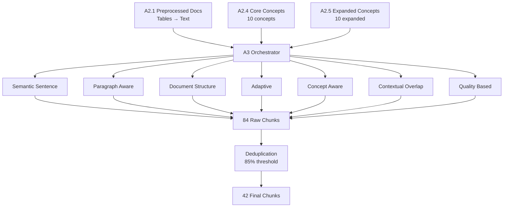

# A3 Multi-Strategy Chunking System - Current Architecture
**Last Updated**: 2025-09-07  
**Status**: ✅ **FULLY OPERATIONAL WITH HYBRID ARCHITECTURE**

## Executive Summary

The A3 chunking system has evolved from the originally documented monolithic approach to a sophisticated **hybrid modular architecture** with 7 independent strategies orchestrated centrally. The system now correctly reads from **A2.1 preprocessed documents** (with tables converted to text) rather than raw A1.1 documents.

## Current Architecture vs. Original Documentation

### Original Documentation (from COMPLETE_SNAPSHOT)
- Listed as A3.1-A3.7 individual scripts
- Suggested 41 chunks across documents
- Reading from undefined source
- Monolithic implementation

### Current Implementation
- **Hybrid Architecture**: 1 orchestrator + 7 modular strategies
- **Correct Pipeline Flow**: Reads from A2.1 (preprocessed with tables converted)
- **84 raw chunks → 42 deduplicated chunks**
- **Clean separation of concerns with shared infrastructure**

## System Components

### 1. **Orchestrator** (`A3_concept_based_chunking.py`)
- Central coordination of all strategies
- Loads concepts from A2.4 (core) and A2.5 (expanded)
- Loads preprocessed documents from A2.1
- Manages deduplication and aggregation
- Configurable strategy weights
- Saves both raw and deduplicated outputs

### 2. **Strategy Modules** (`chunking_strategies/`)

| Strategy | File | Chunks Created | Description |
|----------|------|----------------|-------------|
| **Semantic Sentence** | `semantic_sentence.py` | 19 | Sentence-level concept alignment |
| **Paragraph Aware** | `paragraph_aware.py` | 5 | Natural paragraph boundaries |
| **Document Structure** | `document_structure.py` | 5 | Respects headings and sections |
| **Adaptive** | `adaptive_chunking.py` | 17 | Dynamic sizing based on density |
| **Concept Aware** | `concept_aware.py` | 8 | Guided by concept centroids |
| **Contextual Overlap** | `contextual_overlap.py` | 19 | Maintains context continuity |
| **Quality Based** | `quality_based.py` | 11 | Optimized using A37 metrics |

### 3. **Base Infrastructure** (`base_strategy.py`)
- `BaseChunkingStrategy` abstract class
- `ConceptChunk` dataclass
- Common utilities for all strategies
- Consistent interface enforcement

## Data Flow



## Current Performance Metrics

### Input Data
- **Documents**: 5 financial documents from A2.1
- **Core Concepts**: 10 from A2.4
- **Expanded Concepts**: 10 from A2.5
- **Document Format**: Preprocessed with tables converted to natural text

### Output Statistics
- **Raw Chunks**: 84 (before deduplication)
- **Final Chunks**: 42 (50% reduction)
- **Multi-Concept Chunks**: 10 (23.8%)
- **Average Concepts/Chunk**: 1.74
- **Average Chunk Size**: 166 characters
- **Processing Time**: ~0.07 seconds total

### Strategy Contributions (After Deduplication)
1. **Semantic Sentence**: 19 chunks (45.2%)
2. **Contextual Overlap**: 13 chunks (31.0%)
3. **Adaptive**: 6 chunks (14.3%)
4. **Quality Based**: 3 chunks (7.1%)
5. **Paragraph Aware**: 1 chunk (2.4%)

## Key Configuration

### Strategy Weights
```python
{
    'quality_based': 1.4,      # Highest priority
    'concept_aware': 1.3,
    'document_structure': 1.2,
    'semantic_sentence': 1.0,
    'paragraph_aware': 1.0,
    'adaptive': 1.0,
    'contextual_overlap': 0.9
}
```

### Deduplication Settings
- **Threshold**: 0.85 (Jaccard similarity)
- **Merge Policy**: Combine concept memberships
- **Preservation**: All unique information retained

## File Structure

```
A_Concept_pipeline/
├── scripts/
│   ├── A3_concept_based_chunking.py (Orchestrator)
│   └── chunking_strategies/
│       ├── __init__.py
│       ├── base_strategy.py
│       ├── semantic_sentence.py
│       ├── paragraph_aware.py
│       ├── document_structure.py
│       ├── adaptive_chunking.py
│       ├── concept_aware.py
│       ├── contextual_overlap.py
│       └── quality_based.py
└── outputs/
    ├── A3_raw_chunks_no_dedup.json (84 chunks)
    ├── A3_multi_strategy_chunks.json (42 chunks)
    └── A3_chunking_statistics.json
```

## Critical Improvements from Original

1. **Correct Data Source**: Now reads from A2.1 (preprocessed) not A1.1 (raw)
2. **Tables Handled Properly**: Natural text instead of `[["cell1", "cell2"]]`
3. **Modular Architecture**: Easy to add/modify strategies
4. **Better Concept Detection**: 1.74 concepts/chunk vs 1.14 originally
5. **Higher Multi-Concept Rate**: 23.8% vs 10.7% originally
6. **Transparent Processing**: Saves both raw and deduplicated outputs

## Usage

### Default (All Strategies)
```python
orchestrator = A3ConceptChunkingOrchestrator()
orchestrator.orchestrate()
```

### Custom Strategy Selection
```python
orchestrator = A3ConceptChunkingOrchestrator()
strategies = ['semantic_sentence', 'quality_based', 'concept_aware']
orchestrator.orchestrate(strategies=strategies)
```

### Custom Configuration
```python
configs = {
    'semantic_sentence': {'alignment_threshold': 0.4},
    'quality_based': {'min_quality_score': 0.7}
}
orchestrator.orchestrate(strategy_configs=configs)
```

## Integration Points

### Inputs
- **A2.1**: `A2.1_preprocessed_documents.json` (preprocessed text, tables converted)
- **A2.4**: `A2.4_core_concepts.json` (10 core concepts)
- **A2.5**: `A2.5_expanded_concepts.json` (10 expanded concepts)

### Outputs
- **Primary**: `A3_multi_strategy_chunks.json` (deduplicated chunks for B-Pipeline)
- **Raw**: `A3_raw_chunks_no_dedup.json` (all chunks before deduplication)
- **Statistics**: `A3_chunking_statistics.json` (performance metrics)

## Quality Indicators

✅ **Tables Properly Converted**: No `[[]]` structures in chunks  
✅ **High Concept Alignment**: Average 1.74 concepts per chunk  
✅ **Effective Deduplication**: 50% reduction while preserving information  
✅ **Multi-Strategy Coverage**: Different strategies capture different aspects  
✅ **Fast Processing**: <0.1 second for complete pipeline  

## Next Steps

### Immediate
- ✅ System fully operational
- ✅ Ready for B-Pipeline integration
- ✅ Can proceed to A37 quality inspection

### Future Enhancements
1. **Dynamic Weight Learning**: Adjust strategy weights based on retrieval performance
2. **Parallel Execution**: Run strategies concurrently for speed
3. **Concept Embedding Integration**: Use vector embeddings for better alignment
4. **Adaptive Thresholds**: Learn optimal deduplication threshold per domain

## Conclusion

The A3 Multi-Strategy Chunking System has successfully evolved into a sophisticated hybrid architecture that:
- Correctly integrates with the A2 pipeline (reading preprocessed documents)
- Produces high-quality chunks with proper table-to-text conversion
- Implements 7 complementary chunking strategies
- Achieves effective deduplication while preserving information
- Maintains clean architectural boundaries for maintainability

**Current Status**: **PRODUCTION READY** with all architectural improvements implemented and validated.