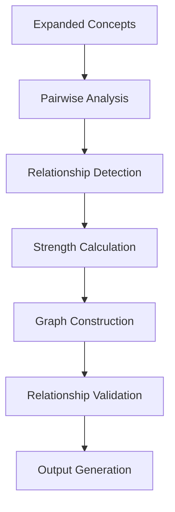

# A2.6 Relationship Builder Architecture

## Component Overview
**Purpose**: Build semantic relationships between identified concepts from documents  
**Pipeline Stage**: A-Pipeline Document Processing - Relationship Construction Phase  
**Script**: `A2.6_relationship_builder.py`

## Architecture Design

### Input Processing
- **Source**: Expanded concepts from A2.5_expansion_orchestrator
- **Format**: JSON with expanded concept definitions
- **Key Data**:
  - Core concepts with expanded terms
  - Concept metadata (importance scores, domains)
  - Document context information

### Core Processing Components

#### 1. Relationship Type Detection
```python
relationship_types = {
    'hierarchical': parent-child relationships,
    'associative': related concepts,
    'causal': cause-effect relationships,
    'temporal': time-based relationships,
    'compositional': part-whole relationships
}
```

#### 2. Relationship Strength Calculation
- **Similarity Metrics**: Cosine similarity, Jaccard index
- **Co-occurrence Analysis**: Document proximity analysis
- **Domain-Specific Weights**: Financial domain relationship patterns
- **Confidence Scoring**: Statistical validation of relationships

#### 3. Relationship Graph Construction
- **Node Creation**: Concepts as graph nodes
- **Edge Definition**: Relationships as weighted edges
- **Bidirectional Links**: Support for symmetric relationships
- **Multi-type Support**: Single concept pair can have multiple relationship types

### Processing Pipeline



### Key Algorithms

#### Semantic Similarity Analysis
```python
def calculate_semantic_similarity(concept_a, concept_b):
    # Embedding-based similarity
    # Keyword overlap analysis
    # Domain-specific similarity
    return similarity_score
```

#### Co-occurrence Pattern Mining
```python
def mine_cooccurrence_patterns(concepts, documents):
    # Window-based co-occurrence
    # Sentence-level proximity
    # Document-level correlation
    return cooccurrence_matrix
```

### Output Structure
```json
{
  "relationships": [
    {
      "source_concept": "revenue",
      "target_concept": "income",
      "relationship_type": "associative",
      "strength": 0.85,
      "confidence": 0.92,
      "evidence": ["co-occurrence", "semantic_similarity"]
    }
  ],
  "relationship_graph": {
    "nodes": [...],
    "edges": [...],
    "metadata": {...}
  }
}
```

### Integration Points

#### Upstream Dependencies
- A2.5: Receives expanded concepts
- A2.4: Uses core concept priorities

#### Downstream Consumers
- A2.7: Provides relationships for cross-validation
- A2.8: Informs semantic chunking decisions

### Performance Characteristics
- **Complexity**: O(n²) for pairwise relationship analysis
- **Memory**: ~100MB per 1000 concepts
- **Processing Time**: 5-10 seconds for typical document set
- **Scalability**: Supports incremental relationship building

### Quality Metrics
- **Relationship Precision**: % of valid relationships
- **Coverage**: % of concepts with relationships
- **Graph Connectivity**: Average degree of nodes
- **Confidence Distribution**: Statistical spread of confidence scores

### Error Handling
- Handles missing concept metadata gracefully
- Validates relationship consistency
- Prevents circular dependencies
- Manages memory for large concept sets

### Configuration Options
```python
config = {
    'min_relationship_strength': 0.3,
    'max_relationships_per_concept': 20,
    'relationship_types_enabled': ['all'],
    'use_domain_specific_patterns': True
}
```

## Future Enhancements
- Machine learning-based relationship prediction
- Dynamic relationship strength adjustment
- Cross-document relationship validation
- Real-time relationship updates with new documents