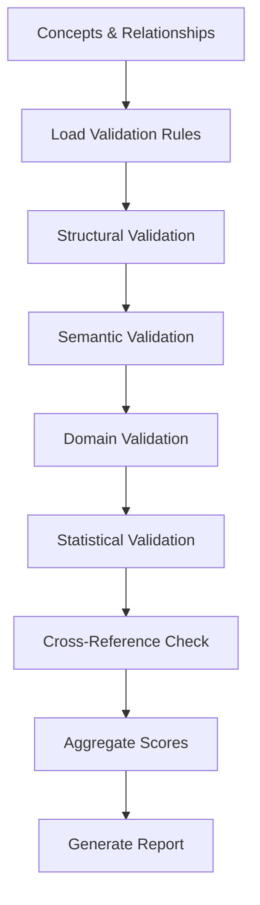

# A2.7 Cross Validator Architecture

## Component Overview
**Purpose**: Cross-validate concepts and relationships across multiple validation strategies  
**Pipeline Stage**: A-Pipeline Document Processing - Validation Phase  
**Script**: `A2.7_cross_validator.py`

## Architecture Design

### Input Processing
- **Source**: Concepts and relationships from A2.6_relationship_builder
- **Format**: JSON with concept graph and relationships
- **Key Data**:
  - Concept definitions with metadata
  - Relationship graph structure
  - Domain alignments from A2.3

### Core Validation Components

#### 1. Multi-Strategy Validation Framework
```python
validation_strategies = {
    'structural_validation': Graph structure consistency,
    'semantic_validation': Semantic coherence checking,
    'domain_validation': Domain-specific rule validation,
    'statistical_validation': Statistical significance testing,
    'cross_reference_validation': BIZBOK alignment verification
}
```

#### 2. Validation Scoring System
- **Individual Scores**: Per-strategy validation scores
- **Weighted Aggregation**: Domain-weighted score combination
- **Confidence Metrics**: Statistical confidence intervals
- **Quality Thresholds**: Configurable acceptance criteria

#### 3. Anomaly Detection
- **Outlier Concepts**: Identify concepts with unusual patterns
- **Weak Relationships**: Flag low-confidence relationships
- **Inconsistencies**: Detect contradictory relationships
- **Coverage Gaps**: Identify missing expected relationships

### Processing Pipeline



### Key Validation Algorithms

#### Structural Consistency Check
```python
def validate_structure(concept_graph):
    # Check for orphaned nodes
    # Verify bidirectional relationships
    # Detect circular dependencies
    # Validate hierarchy constraints
    return structural_score
```

#### Semantic Coherence Validation
```python
def validate_semantic_coherence(concepts, relationships):
    # Embedding space consistency
    # Semantic drift detection
    # Context preservation check
    # Term disambiguation validation
    return semantic_score
```

#### Domain Rule Validation
```python
def validate_domain_rules(concepts, domain='financial'):
    # Apply domain-specific constraints
    # Check required relationships
    # Validate concept categories
    # Verify domain terminology
    return domain_score
```

### Output Structure
```json
{
  "validation_results": {
    "overall_score": 0.87,
    "strategy_scores": {
      "structural": 0.92,
      "semantic": 0.85,
      "domain": 0.88,
      "statistical": 0.83,
      "cross_reference": 0.90
    },
    "validated_concepts": [...],
    "flagged_issues": [
      {
        "type": "weak_relationship",
        "concept_pair": ["revenue", "tax"],
        "confidence": 0.25,
        "recommendation": "review or remove"
      }
    ],
    "quality_metrics": {
      "precision": 0.89,
      "recall": 0.85,
      "f1_score": 0.87
    }
  }
}
```

### Validation Rules Engine

#### Rule Categories
1. **Mandatory Rules**: Must-pass validation criteria
2. **Warning Rules**: Generate warnings but don't fail
3. **Informational Rules**: Provide insights and suggestions

#### Rule Definition Format
```python
validation_rule = {
    'rule_id': 'VAL_001',
    'category': 'mandatory',
    'condition': 'concept_importance > 0.3',
    'error_message': 'Concept importance too low',
    'remediation': 'Review concept extraction'
}
```

### Integration Points

#### Upstream Dependencies
- A2.6: Receives relationships to validate
- A2.3: Uses BIZBOK alignment data
- A2.5: Accesses expanded concept metadata

#### Downstream Consumers
- A2.8: Provides validated concepts for chunking
- A2.9: Supplies quality metrics for R4X enhancement

### Performance Characteristics
- **Complexity**: O(n) for concept validation, O(e) for edge validation
- **Memory**: ~50MB per 1000 concepts
- **Processing Time**: 2-5 seconds for typical validation
- **Parallelization**: Supports parallel strategy execution

### Quality Assurance

#### Validation Metrics
- **Coverage**: % of concepts validated
- **Pass Rate**: % passing all validations
- **Issue Detection Rate**: Issues found per concept
- **False Positive Rate**: Incorrectly flagged valid concepts

#### Validation Confidence
```python
confidence_levels = {
    'high': score >= 0.85,
    'medium': 0.65 <= score < 0.85,
    'low': score < 0.65
}
```

### Error Handling
- Graceful handling of missing validation rules
- Fallback to default validation when domain rules unavailable
- Detailed error reporting with remediation suggestions
- Validation checkpoint recovery

### Configuration Options
```python
config = {
    'validation_strategies': ['all'],
    'min_validation_score': 0.7,
    'strict_mode': False,
    'parallel_validation': True,
    'max_issues_to_report': 100,
    'auto_remediation': False
}
```

## Advanced Features

### Adaptive Validation
- Learning from validation history
- Dynamic threshold adjustment
- Pattern-based rule generation
- Continuous improvement feedback loop

### Cross-Document Validation
- Consistency across document sets
- Temporal validation for time-series data
- Multi-source verification
- Conflict resolution strategies

## Future Enhancements
- ML-based validation rule learning
- Real-time validation during extraction
- Interactive validation UI
- Automated remediation workflows