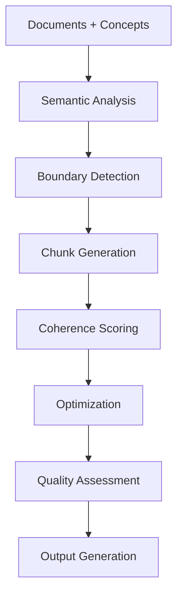

# A2.8 Semantic Chunking Architecture

## Component Overview
**Purpose**: Create semantically coherent document chunks optimized for retrieval and understanding  
**Pipeline Stage**: A-Pipeline Document Processing - Final Chunking Phase  
**Script**: `A2.8_semantic_chunking.py`

## Architecture Design

### Input Processing
- **Source**: Validated concepts and relationships from A2.7_cross_validator
- **Document Data**: Original documents from A1_document_loader
- **Format**: JSON concepts + raw document text
- **Key Data**:
  - Validated concept graph
  - Document structure and content
  - Concept-document mappings

### Core Chunking Components

#### 1. Chunking Strategy Engine
```python
chunking_strategies = {
    'concept_guided': Chunks centered around key concepts,
    'semantic_boundary': Natural semantic unit detection,
    'hybrid_approach': Combination of multiple strategies,
    'coverage_forced': Ensure all content is chunked,
    'overlap_sliding': Sliding window with overlap
}
```

#### 2. Semantic Coherence Analyzer
- **Coherence Scoring**: Measure semantic unity within chunks
- **Boundary Detection**: Identify natural semantic boundaries
- **Concept Density**: Calculate concept concentration
- **Information Completeness**: Ensure chunks are self-contained

#### 3. Chunk Optimization
- **Size Balancing**: Maintain consistent chunk sizes
- **Overlap Management**: Strategic overlap for context
- **Concept Coverage**: Ensure key concepts are included
- **Retrieval Optimization**: Structure for efficient retrieval

### Processing Pipeline



### Key Algorithms

#### Concept-Guided Chunking
```python
def create_concept_guided_chunks(document, concepts):
    chunks = []
    for concept in priority_concepts:
        # Find concept occurrences
        # Expand context window
        # Extract semantic unit
        # Score coherence
        chunk = extract_semantic_chunk(document, concept)
        chunks.append(chunk)
    return chunks
```

#### Semantic Boundary Detection
```python
def detect_semantic_boundaries(text, concepts):
    # Sentence embedding analysis
    # Topic shift detection
    # Concept transition points
    # Paragraph structure analysis
    boundaries = identify_natural_breaks(text)
    return boundaries
```

#### Coherence Scoring
```python
def calculate_coherence_score(chunk, concepts):
    # Concept density measurement
    # Semantic similarity within chunk
    # Information completeness check
    # Context preservation score
    return coherence_metrics
```

### Chunk Structure
```json
{
  "semantic_chunks": [
    {
      "chunk_id": "doc1_chunk_0",
      "doc_id": "finqa_test_617",
      "chunk_text": "...",
      "word_count": 250,
      "coverage_type": "conceptual",
      "primary_centroid": "revenue",
      "concepts": ["revenue", "income", "financial"],
      "semantic_coherence": 0.85,
      "concept_density": 0.72,
      "coverage_confidence": 0.88,
      "creation_method": "concept_guided",
      "content_type": "narrative",
      "boundaries": {
        "start_char": 0,
        "end_char": 1250,
        "start_sentence": 0,
        "end_sentence": 12
      }
    }
  ],
  "chunking_metadata": {
    "total_chunks": 45,
    "avg_chunk_size": 245,
    "coverage_rate": 0.98,
    "avg_coherence": 0.83
  }
}
```

### Chunking Strategies

#### Concept-Guided Strategy
- Identify high-importance concepts
- Create chunks around concept clusters
- Maintain semantic context
- Balance chunk sizes

#### Semantic Boundary Strategy
- Detect topic transitions
- Preserve complete semantic units
- Respect document structure
- Maintain narrative flow

#### Hybrid Strategy
- Combine multiple approaches
- Weighted strategy selection
- Adaptive to document type
- Optimized for retrieval

### Quality Metrics

#### Chunk Quality Assessment
```python
quality_metrics = {
    'coherence': Internal semantic consistency,
    'completeness': Information self-containment,
    'density': Concept concentration,
    'relevance': Alignment with key concepts,
    'retrievability': Optimization for search
}
```

#### Coverage Analysis
- **Document Coverage**: % of document included in chunks
- **Concept Coverage**: % of concepts represented
- **Overlap Ratio**: Amount of content overlap
- **Gap Analysis**: Identify unchunked content

### Integration Points

#### Upstream Dependencies
- A2.7: Validated concepts and relationships
- A2.6: Relationship graph for context
- A1: Original document structure

#### Downstream Consumers
- A2.9: Provides chunks for R4X enhancement
- B-Pipeline: Chunks used for retrieval
- Storage: Chunk index for search

### Performance Characteristics
- **Complexity**: O(n*m) where n=documents, m=concepts
- **Memory**: ~200MB per 1000 chunks
- **Processing Time**: 10-20 seconds for typical document set
- **Chunk Size**: Configurable, typically 200-500 words

### Optimization Techniques

#### Chunk Size Optimization
```python
optimization_params = {
    'min_chunk_size': 100,
    'max_chunk_size': 500,
    'target_chunk_size': 250,
    'overlap_size': 50,
    'boundary_flexibility': 0.2
}
```

#### Retrieval Optimization
- Index-friendly chunk structure
- Embedding-optimized text length
- Query-chunk alignment
- Semantic search optimization

### Error Handling
- Handles documents without concepts
- Manages extremely long documents
- Deals with structured data (tables)
- Processes multi-language content

### Configuration Options
```python
config = {
    'chunking_strategy': 'hybrid',
    'target_chunk_size': 250,
    'min_coherence_score': 0.6,
    'enable_overlap': True,
    'overlap_size': 50,
    'force_coverage': True,
    'preserve_tables': True,
    'respect_paragraphs': True
}
```

## Advanced Features

### Adaptive Chunking
- Document type detection
- Dynamic strategy selection
- Content-aware boundaries
- Quality-based refinement

### Multi-Modal Chunking
- Text and table integration
- Metadata preservation
- Cross-reference handling
- Footnote management

### Intelligent Overlap
- Context preservation
- Smooth transitions
- Redundancy minimization
- Retrieval enhancement

## Output Formats

### CSV Summary Output
```csv
Doc_ID,Chunk_ID,Chunk_Text,Word_Count,Coverage_Type,Primary_Centroid,Semantic_Coherence,Concept_Density,Coverage_Confidence,Creation_Method,Content_Type
```

### JSON Detailed Output
- Complete chunk data
- Metadata and metrics
- Concept mappings
- Boundary information

## Future Enhancements
- Neural chunking models
- Dynamic chunk size based on complexity
- Cross-document chunk alignment
- Real-time incremental chunking
- Multi-language support optimization