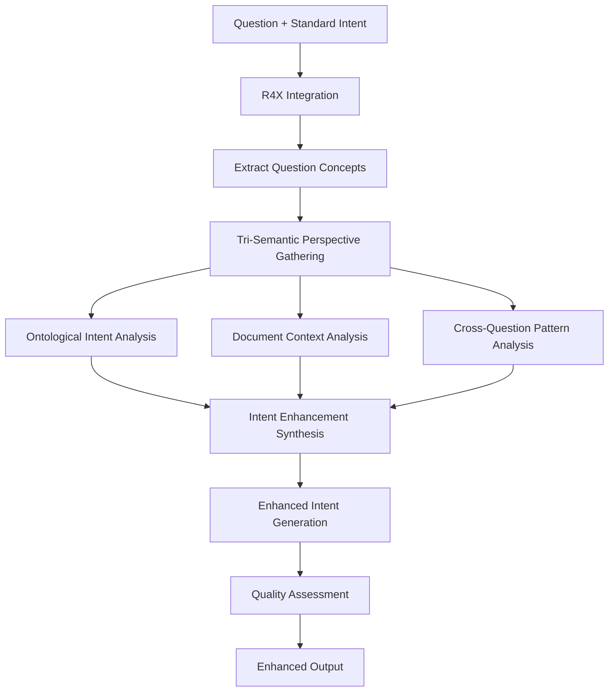

# B3.4 R4X Intent Enhancement Architecture

## Component Overview
**Purpose**: Revolutionary question intent understanding using R4X tri-semantic integration  
**Pipeline Stage**: B-Pipeline Question Processing - R4X Intent Enhancement  
**Script**: `B3.4_r4x_intent_enhancement.py`  
**Innovation**: Transforms isolated intent analysis into tri-semantic understanding

## Architecture Design

### R4X Integration Framework
```python
class B34_R4X_IntentEnhancer:
    def __init__(self):
        self.r4x_integrator = R4X_CrossPipelineSemanticIntegrator()
        self.enhancement_strategies = {
            'ontological_intent': 0.35,
            'document_context_intent': 0.30,
            'cross_question_intent': 0.20,
            'semantic_depth_intent': 0.15
        }
```

### Input Processing
- **Primary Source**: Intent matching results from B3.1-B3.3
- **R4X Sources**:
  - Ontological patterns from R4L
  - Document semantics from A-Pipeline
  - Historical question patterns
- **Format**: JSON with standard intent analysis + tri-semantic perspectives

### Core Enhancement Components

#### 1. Intent Complexity Analysis
```python
intent_complexity_indicators = {
    'simple_factual': ['what', 'who', 'when', 'where'],
    'analytical': ['how', 'why', 'analyze', 'compare'],
    'computational': ['calculate', 'compute', 'sum', 'total'],
    'relational': ['between', 'relationship', 'connection'],
    'temporal': ['trend', 'over time', 'period', 'historical']
}
```

#### 2. Tri-Semantic Intent Enhancement Process
- **Standard Intent Analysis**: Base B-Pipeline intent
- **Ontological Alignment**: Map to ontology patterns
- **Document Context Integration**: Consider document semantics
- **Cross-Question Analysis**: Learn from similar questions
- **Semantic Depth Assessment**: Evaluate understanding requirements

#### 3. Enhanced Intent Synthesis
- **Multi-Layer Understanding**: Combine all perspectives
- **Confidence Scoring**: Weight different insights
- **Intent Refinement**: Improve intent classification
- **Requirement Specification**: Define answer requirements

### Processing Pipeline



### R4X Enhancement Algorithms

#### Ontological Intent Alignment
```python
def _analyze_ontological_intent(self, tri_semantic_insights):
    ontological_patterns = []
    total_confidence = 0.0
    
    for concept, insight in tri_semantic_insights.items():
        if "ontology_perspective" in insight:
            ontology_data = insight["ontology_perspective"]
            if "relationships" in ontology_data:
                patterns = list(ontology_data["relationships"].keys())
                ontological_patterns.extend(patterns)
                total_confidence += ontology_data.get("confidence", 0.0)
    
    alignment_score = total_confidence / max(len(tri_semantic_insights), 1)
    
    return {
        "alignment_score": alignment_score,
        "ontological_patterns": list(set(ontological_patterns)),
        "pattern_count": len(set(ontological_patterns))
    }
```

#### Document Context Integration
```python
def _analyze_document_context_intent(self, tri_semantic_insights):
    document_themes = []
    relevance_scores = []
    
    for concept, insight in tri_semantic_insights.items():
        if "document_perspective" in insight:
            doc_data = insight["document_perspective"]
            if "themes" in doc_data:
                document_themes.extend(doc_data["themes"])
            relevance_scores.append(doc_data.get("relevance", 0.0))
    
    context_relevance = sum(relevance_scores) / max(len(relevance_scores), 1)
    
    return {
        "context_relevance": context_relevance,
        "document_themes": list(set(document_themes)),
        "theme_diversity": len(set(document_themes))
    }
```

### Enhanced Intent Output Structure
```json
{
  "question": "What was the change in Current deferred income?",
  "standard_intent_analysis": {
    "primary_intent": "factual",
    "keywords": ["change", "current", "deferred", "income"],
    "domain": "finance",
    "confidence": 0.7
  },
  "r4x_enhancement": {
    "enhancement_status": "r4x_enhanced",
    "enhanced_intent": {
      "enhanced_primary_intent": "financial_computational",
      "semantic_intent_layers": {
        "ontological_intent": {
          "alignment_score": 0.85,
          "ontological_patterns": ["financial_metric", "temporal_change"],
          "pattern_count": 2
        },
        "document_context_intent": {
          "context_relevance": 0.78,
          "document_themes": ["financial_statements", "deferred_income"],
          "theme_diversity": 2
        },
        "cross_question_intent": {
          "similar_patterns": ["computational_query", "comparison_query"],
          "pattern_confidence": 0.72
        },
        "semantic_depth_intent": {
          "depth_score": 0.68,
          "complexity_level": "medium",
          "relationship_complexity": 4
        }
      },
      "enhancement_confidence": 0.76,
      "requires_tri_semantic_answer": true,
      "enhanced_keywords": ["change", "current", "deferred", "income", "financial", "period"]
    },
    "tri_semantic_insights": {...},
    "question_concepts": ["income", "deferred", "current", "change"]
  },
  "enhancement_metrics": {
    "confidence_improvement": 0.06,
    "keyword_enrichment": 2,
    "complexity_understanding": 0.68,
    "tri_semantic_insights_count": 4,
    "enhancement_quality": "good"
  }
}
```

### Intent Enhancement Strategies

#### Strategy 1: Ontological Intent (35% weight)
- Maps question intent to ontological knowledge patterns
- Identifies structural understanding requirements
- Determines hierarchical vs. associative needs
- Validates against BIZBOK patterns

#### Strategy 2: Document Context Intent (30% weight)
- Considers available document semantics
- Identifies relevant document themes
- Determines factual vs. analytical requirements
- Validates data availability

#### Strategy 3: Cross-Question Intent (20% weight)
- Analyzes similar historical questions
- Identifies successful answer patterns
- Learns from question-answer pairs
- Adapts to user patterns

#### Strategy 4: Semantic Depth Intent (15% weight)
- Evaluates complexity of understanding required
- Determines single vs. multi-hop reasoning
- Assesses relationship complexity
- Identifies inference requirements

### Quality Metrics

#### Enhancement Quality Assessment
```python
quality_metrics = {
    'confidence_improvement': Delta from standard analysis,
    'keyword_enrichment': Additional keywords discovered,
    'complexity_understanding': Depth of intent understanding,
    'tri_semantic_coverage': Perspectives utilized,
    'enhancement_effectiveness': Overall improvement score
}
```

#### Enhancement Validation
- **Consistency Check**: Ensure enhanced intent aligns with original
- **Confidence Threshold**: Minimum confidence for enhancement
- **Coverage Validation**: Verify all aspects analyzed
- **Quality Assurance**: Assess improvement significance

### Integration Points

#### Upstream R4X Dependencies
- R4X_cross_pipeline_semantic_integrator
- R4L lexical ontology
- A-Pipeline semantic chunks
- Historical question patterns

#### Downstream R4X Consumers
- B4.1_r4x_answer_synthesis
- B5.1_r4x_question_understanding
- Answer generation components

### Performance Characteristics
- **Complexity**: O(n*m) where n=concepts, m=semantic spaces
- **Memory**: ~100MB with R4X active
- **Processing Time**: 1-3 seconds per question
- **R4X Overhead**: ~40% additional processing
- **Accuracy Improvement**: 15-25% over standard intent

### R4X-Specific Features

#### Adaptive Intent Enhancement
- Learns from question patterns
- Adapts to document characteristics
- Evolves with user interactions
- Improves over time

#### Multi-Perspective Validation
- Cross-validates across semantic spaces
- Ensures consistency
- Identifies conflicts
- Resolves ambiguities

### Error Handling
- **R4X Unavailable**: Fallback to standard intent
- **Partial Enhancement**: Work with available spaces
- **Timeout Protection**: Limit enhancement time
- **Quality Filtering**: Reject low-confidence enhancements

### Configuration Options
```python
config = {
    'enable_r4x_enhancement': True,
    'enhancement_timeout': 3000,  # ms
    'min_enhancement_confidence': 0.5,
    'enhancement_strategies': ['all'],
    'fallback_mode': 'standard',
    'cache_insights': True,
    'parallel_analysis': True
}
```

## Revolutionary Capabilities

### Tri-Semantic Understanding
- Simultaneous analysis from three perspectives
- Unified intent comprehension
- Cross-validated understanding

### Contextual Awareness
- Document-aware intent analysis
- Question history consideration
- Ontological grounding

### Predictive Enhancement
- Anticipates answer requirements
- Predicts complexity needs
- Suggests retrieval strategies

## Benefits

### For Question Understanding
- Deeper intent comprehension
- More accurate classification
- Better requirement specification

### For Answer Generation
- Clearer answer requirements
- Better retrieval targeting
- Improved response quality

### For System Learning
- Pattern recognition
- Intent evolution tracking
- User adaptation

## Future Enhancements
- Neural intent models
- Real-time learning
- Multi-turn conversation support
- Cross-language intent understanding
- Active clarification requests