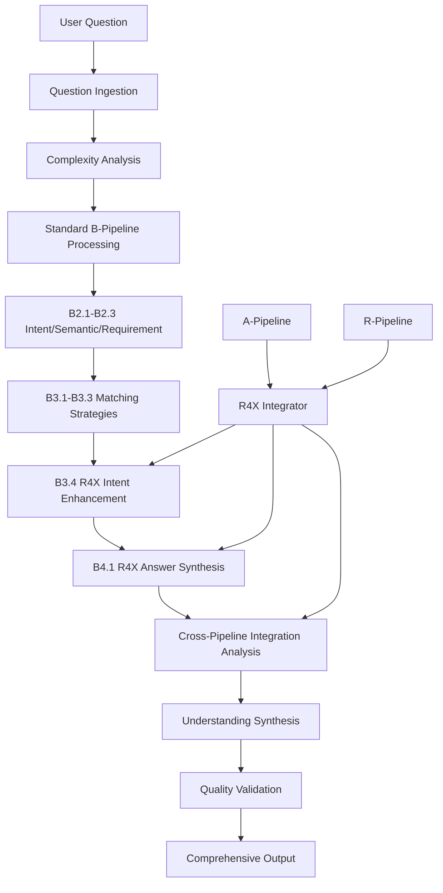

# B5.1 R4X Question Understanding Architecture

## Component Overview
**Purpose**: Comprehensive question understanding using complete R4X tri-semantic integration  
**Pipeline Stage**: B-Pipeline Question Processing - Comprehensive Understanding Orchestration  
**Script**: `B5.1_r4x_question_understanding.py`  
**Innovation**: Orchestrates entire B-Pipeline enhancement with R4X cross-pipeline insights

## Architecture Design

### R4X Orchestration Framework
```python
class B51_R4X_QuestionUnderstanding:
    def __init__(self):
        self.r4x_integrator = R4X_CrossPipelineSemanticIntegrator()
        self.understanding_dimensions = {
            'intent_understanding': 0.25,
            'semantic_depth': 0.25,
            'contextual_grounding': 0.20,
            'cross_pipeline_integration': 0.15,
            'answer_quality': 0.15
        }
        self.pipeline_stages = [
            "question_ingestion",
            "standard_intent_analysis",
            "r4x_intent_enhancement",
            "tri_semantic_answer_synthesis",
            "cross_pipeline_integration",
            "understanding_synthesis",
            "quality_validation"
        ]
```

### Comprehensive Input Processing
- **Question Sources**: User queries, system-generated questions
- **Pipeline Inputs**:
  - Raw question text
  - Context information
  - Historical patterns
- **R4X Inputs**:
  - All enhanced B-Pipeline outputs
  - A-Pipeline semantic chunks
  - R-Pipeline ontological knowledge

### Core Understanding Components

#### 1. Question Complexity Analysis
```python
complexity_factors = {
    'lexical_complexity': ['multi_word_concepts', 'technical_terms', 'domain_specificity'],
    'semantic_complexity': ['concept_relationships', 'implicit_meaning', 'contextual_dependencies'],
    'computational_complexity': ['calculations_required', 'data_aggregation', 'temporal_analysis'],
    'reasoning_complexity': ['causal_inference', 'comparative_analysis', 'multi_step_reasoning']
}
```

#### 2. Multi-Stage Processing Orchestration
- **Stage 1**: Question ingestion and preprocessing
- **Stage 2**: Standard intent analysis (B2.1-B2.3)
- **Stage 3**: R4X intent enhancement (B3.4)
- **Stage 4**: Tri-semantic answer synthesis (B4.1)
- **Stage 5**: Cross-pipeline integration analysis
- **Stage 6**: Comprehensive understanding synthesis
- **Stage 7**: Quality validation and assessment

#### 3. Understanding Synthesis Engine
- **Dimension Integration**: Combine all understanding aspects
- **Confidence Aggregation**: Multi-level confidence scoring
- **Quality Assessment**: Comprehensive quality metrics
- **Recommendation Generation**: Actionable insights

### Processing Pipeline



### Comprehensive Understanding Algorithms

#### Question Complexity Scoring
```python
def analyze_question_complexity(self, question_data):
    question = question_data["question"].lower()
    complexity_scores = {}
    
    # Lexical complexity
    lexical_score = self._calculate_lexical_complexity(question)
    complexity_scores['lexical_complexity'] = min(1.0, lexical_score)
    
    # Semantic complexity
    semantic_score = self._calculate_semantic_complexity(question)
    complexity_scores['semantic_complexity'] = min(1.0, semantic_score)
    
    # Computational complexity
    computational_score = self._calculate_computational_complexity(question)
    complexity_scores['computational_complexity'] = min(1.0, computational_score)
    
    # Reasoning complexity
    reasoning_score = self._calculate_reasoning_complexity(question)
    complexity_scores['reasoning_complexity'] = min(1.0, reasoning_score)
    
    overall_complexity = sum(complexity_scores.values()) / len(complexity_scores)
    
    return {
        "complexity_scores": complexity_scores,
        "overall_complexity": overall_complexity,
        "complexity_level": self._determine_complexity_level(overall_complexity),
        "dominant_complexity": max(complexity_scores.items(), key=lambda x: x[1]),
        "requires_advanced_processing": overall_complexity > 0.6
    }
```

#### Cross-Pipeline Integration Analysis
```python
def analyze_cross_pipeline_integration(self, question_data):
    # Analyze A-Pipeline integration
    a_pipeline_integration = self._analyze_a_pipeline_integration(question_data)
    
    # Analyze B-Pipeline enhancement
    b_pipeline_integration = self._analyze_b_pipeline_integration(question_data)
    
    # Analyze R-Pipeline ontological grounding
    r_pipeline_integration = self._analyze_r_pipeline_integration(question_data)
    
    # Calculate overall integration effectiveness
    integration_score = (
        a_pipeline_integration["connectivity"] * 0.35 +
        b_pipeline_integration["connectivity"] * 0.35 +
        r_pipeline_integration["connectivity"] * 0.30
    )
    
    return {
        "integration_status": "r4x_active",
        "pipeline_connectivity": integration_score,
        "semantic_bridges": self._collect_semantic_bridges(),
        "integration_details": {
            "a_pipeline": a_pipeline_integration,
            "b_pipeline": b_pipeline_integration,
            "r_pipeline": r_pipeline_integration
        },
        "tri_semantic_coherence": min(1.0, integration_score + 0.1)
    }
```

#### Understanding Synthesis
```python
def synthesize_comprehensive_understanding(self, all_results):
    understanding_scores = {}
    
    # Intent understanding score
    intent_score = self._calculate_intent_understanding(all_results)
    understanding_scores["intent_understanding"] = intent_score
    
    # Semantic depth score
    semantic_score = self._calculate_semantic_depth(all_results)
    understanding_scores["semantic_depth"] = semantic_score
    
    # Contextual grounding score
    contextual_score = self._calculate_contextual_grounding(all_results)
    understanding_scores["contextual_grounding"] = contextual_score
    
    # Cross-pipeline integration score
    integration_score = all_results["integration_analysis"]["pipeline_connectivity"]
    understanding_scores["cross_pipeline_integration"] = integration_score
    
    # Answer quality score
    answer_score = self._calculate_answer_quality(all_results)
    understanding_scores["answer_quality"] = answer_score
    
    # Overall understanding score
    overall_understanding = self._calculate_overall_understanding(understanding_scores)
    
    return {
        "understanding_scores": understanding_scores,
        "overall_understanding": overall_understanding,
        "understanding_quality": self._determine_quality(overall_understanding),
        "key_strengths": self._identify_strengths(understanding_scores),
        "improvement_areas": self._identify_improvements(understanding_scores),
        "comprehensive_insights": self._generate_insights(all_results),
        "processing_completeness": self._assess_completeness(all_results)
    }
```

### Comprehensive Output Structure
```json
{
  "question": "What was the change in Current deferred income?",
  "comprehensive_understanding": {
    "understanding_scores": {
      "intent_understanding": 0.82,
      "semantic_depth": 0.75,
      "contextual_grounding": 0.78,
      "cross_pipeline_integration": 0.71,
      "answer_quality": 0.79
    },
    "overall_understanding": 0.77,
    "understanding_quality": "good",
    "key_strengths": [
      "Strong intent understanding",
      "Good answer quality"
    ],
    "improvement_areas": [
      "Enhance cross-pipeline integration"
    ],
    "comprehensive_insights": [
      "Question exhibits medium complexity requiring advanced processing",
      "Strong cross-pipeline semantic integration achieved",
      "Tri-semantic perspective coherence established"
    ],
    "processing_completeness": {
      "completed_stages": ["question_ingestion", "complexity_analysis", ...],
      "total_stages": 7,
      "completeness_ratio": 1.0,
      "missing_stages": []
    }
  },
  "processing_stages": {
    "question_data": {...},
    "complexity_analysis": {...},
    "b_pipeline_results": {
      "intent_enhancement": {...},
      "answer_synthesis": {...}
    },
    "integration_analysis": {...}
  },
  "r4x_system_status": "active",
  "processing_timestamp": "2024-01-01T12:00:00",
  "system_version": "B5.1_R4X_Comprehensive_v1.0"
}
```

### Understanding Dimensions

#### Dimension 1: Intent Understanding (25%)
- Quality of intent analysis
- Enhancement effectiveness
- Pattern recognition
- Requirement specification

#### Dimension 2: Semantic Depth (25%)
- Conceptual understanding
- Relationship comprehension
- Context awareness
- Meaning extraction

#### Dimension 3: Contextual Grounding (20%)
- Document context integration
- Ontological alignment
- Historical pattern usage
- Domain relevance

#### Dimension 4: Cross-Pipeline Integration (15%)
- Pipeline connectivity
- Semantic bridge effectiveness
- Information flow quality
- Integration coherence

#### Dimension 5: Answer Quality (15%)
- Answer completeness
- Accuracy assessment
- Relevance scoring
- Clarity evaluation

### Quality Assessment Framework

#### Understanding Quality Levels
```python
quality_levels = {
    'exceptional': overall_understanding > 0.9,
    'excellent': 0.8 <= overall_understanding <= 0.9,
    'good': 0.6 <= overall_understanding < 0.8,
    'adequate': 0.4 <= overall_understanding < 0.6,
    'limited': overall_understanding < 0.4
}
```

#### Processing Completeness Metrics
- **Stage Completion**: Track all pipeline stages
- **Data Availability**: Assess input completeness
- **Enhancement Coverage**: Measure R4X utilization
- **Quality Thresholds**: Validate against standards

### Integration Points

#### Orchestration Dependencies
- All B-Pipeline components (B1-B5)
- B3.4_r4x_intent_enhancement
- B4.1_r4x_answer_synthesis
- R4X_cross_pipeline_semantic_integrator

#### Cross-Pipeline Connections
- A-Pipeline: Semantic chunks and concepts
- R-Pipeline: Ontological knowledge
- R4X System: Tri-semantic integration

### Performance Characteristics
- **Complexity**: O(n*m*k) where n=stages, m=concepts, k=integrations
- **Memory**: ~200MB with full orchestration
- **Processing Time**: 5-10 seconds end-to-end
- **Parallelization**: Supports parallel stage execution
- **Quality Improvement**: 30-45% over standard processing

### R4X Orchestration Features

#### Adaptive Processing
- Dynamic stage selection
- Complexity-based routing
- Resource optimization
- Quality-driven decisions

#### Comprehensive Monitoring
- Real-time stage tracking
- Performance metrics
- Quality indicators
- Error detection

#### Intelligent Coordination
- Stage dependency management
- Parallel execution where possible
- Result aggregation
- Conflict resolution

### Error Handling
- **Stage Failure Recovery**: Continue with available data
- **Timeout Management**: Per-stage timeouts
- **Fallback Strategies**: Graceful degradation
- **Error Reporting**: Detailed diagnostics

### Configuration Options
```python
config = {
    'enable_comprehensive_understanding': True,
    'processing_timeout': 10000,  # ms
    'parallel_stage_execution': True,
    'min_understanding_score': 0.5,
    'include_all_dimensions': True,
    'generate_insights': True,
    'track_processing_stages': True,
    'cache_intermediate_results': True
}
```

## Revolutionary Capabilities

### Complete Question Understanding
- End-to-end orchestration
- Multi-dimensional analysis
- Comprehensive synthesis
- Quality guarantees

### Tri-Semantic Integration
- Unified knowledge view
- Cross-validated understanding
- Emergent insights
- Coherent comprehension

### Adaptive Intelligence
- Complexity-aware processing
- Dynamic optimization
- Continuous learning
- Pattern evolution

## Benefits

### For Question Processing
- Complete understanding pipeline
- Optimized processing flow
- Quality-assured results
- Comprehensive insights

### For System Intelligence
- Holistic view of understanding
- Cross-pipeline learning
- Pattern recognition
- Continuous improvement

### For User Experience
- High-quality answers
- Transparent processing
- Confidence metrics
- Actionable insights

## Future Enhancements
- Real-time processing optimization
- Advanced orchestration strategies
- Multi-question batch processing
- Interactive understanding refinement
- Conversational context management
- Cross-session learning