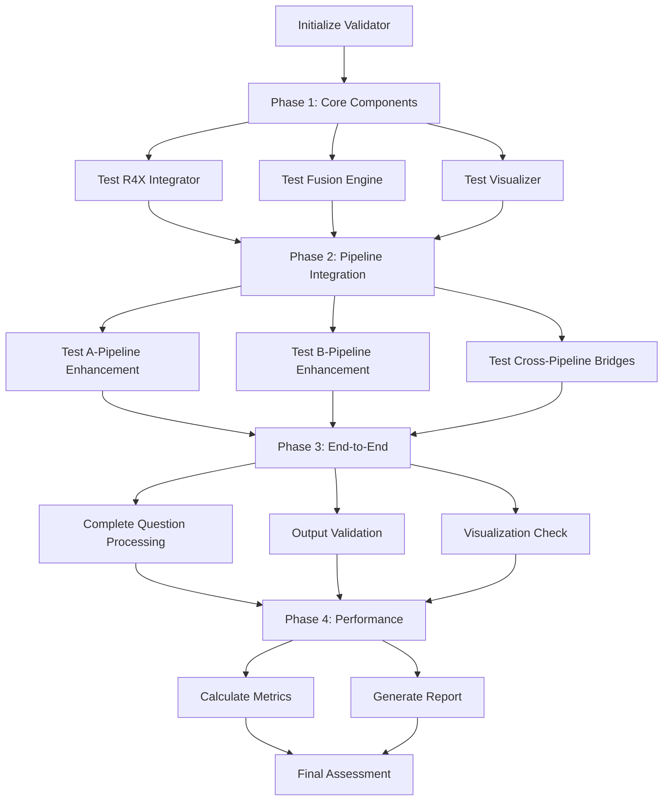

# R4X System Validation Architecture

## Component Overview
**Purpose**: Comprehensive testing and validation of the complete R4X Cross-Pipeline Semantic Integration system  
**Pipeline Stage**: R-Pipeline Testing - System Validation Suite  
**Script**: `R4X_system_validation.py`  
**Innovation**: End-to-end validation framework for tri-semantic integration system

## Architecture Design

### Validation Framework
```python
class R4X_SystemValidator:
    def __init__(self):
        self.test_results = {
            'core_components': {},
            'pipeline_integrations': {},
            'end_to_end': {},
            'performance_metrics': {},
            'quality_assessments': {}
        }
        self.test_configurations = {
            'test_question': "What was the change in Current deferred income?",
            'expected_components': [
                'R4X_cross_pipeline_semantic_integrator.py',
                'R4X_semantic_fusion_engine.py',
                'R5X_tri_semantic_visualizer.py'
            ],
            'enhanced_scripts': {
                'A_Pipeline': ['A2.9_r4x_semantic_enhancement.py'],
                'B_Pipeline': ['B3.4', 'B4.1', 'B5.1']
            }
        }
```

### Test Categories

#### 1. Core Component Testing
```python
core_component_tests = {
    'r4x_integrator': {
        'initialization': Test integrator startup,
        'semantic_space_loading': Verify three spaces load,
        'unified_concept_view': Test concept unification,
        'bridge_building': Validate semantic bridges
    },
    'fusion_engine': {
        'strategy_initialization': Test all fusion strategies,
        'fusion_execution': Validate fusion algorithms,
        'meta_fusion': Test meta-fusion synthesis,
        'confidence_calculation': Verify confidence scoring
    },
    'visualizer': {
        'data_loading': Test tri-semantic data loading,
        'network_generation': Validate network creation,
        'visualization_rendering': Test HTML generation,
        'server_launch': Verify web server functionality
    }
}
```

#### 2. Pipeline Integration Testing
```python
pipeline_integration_tests = {
    'a_pipeline_enhancement': {
        'script_execution': Test A2.9 enhancement script,
        'r4x_communication': Verify R4X integration,
        'output_generation': Check enhanced outputs,
        'quality_metrics': Validate enhancement quality
    },
    'b_pipeline_enhancement': {
        'intent_enhancement': Test B3.4 script,
        'answer_synthesis': Test B4.1 script,
        'comprehensive_understanding': Test B5.1 script,
        'end_to_end_flow': Validate complete B-Pipeline
    },
    'cross_pipeline_bridges': {
        'bridge_creation': Test semantic bridge building,
        'bridge_traversal': Validate information flow,
        'bridge_quality': Assess bridge effectiveness
    }
}
```

#### 3. End-to-End Testing
```python
end_to_end_tests = {
    'complete_question_processing': {
        'question_ingestion': Test question input,
        'pipeline_execution': Run all pipelines,
        'r4x_integration': Verify R4X enhancement,
        'answer_generation': Validate final answer
    },
    'output_file_generation': {
        'expected_outputs': List of required files,
        'file_validation': Check file contents,
        'format_verification': Validate data formats
    },
    'visualization_generation': {
        'html_creation': Test visualization file,
        'data_inclusion': Verify data in visualization,
        'interactivity': Check interactive features
    }
}
```

### Validation Pipeline



### Test Execution Framework

#### Component Test Execution
```python
def test_core_r4x_components(self):
    core_results = {}
    
    # Test R4X Integrator
    try:
        from R4X_cross_pipeline_semantic_integrator import R4X_CrossPipelineSemanticIntegrator
        integrator = R4X_CrossPipelineSemanticIntegrator()
        
        # Test unified concept view
        unified_view = integrator.get_unified_concept_view("test_concept")
        
        core_results['cross_pipeline_integrator'] = {
            'status': 'pass',
            'initialization': True,
            'unified_concept_view': unified_view is not None,
            'semantic_spaces_count': len(integrator.semantic_spaces)
        }
    except Exception as e:
        core_results['cross_pipeline_integrator'] = {
            'status': 'fail',
            'error': str(e)
        }
    
    return core_results
```

#### Pipeline Script Testing
```python
def test_enhanced_pipeline_scripts(self):
    pipeline_results = {}
    
    for pipeline, scripts in self.enhanced_scripts.items():
        for script_name in scripts:
            # Execute script
            result = subprocess.run(
                [sys.executable, str(script_path)],
                capture_output=True,
                text=True,
                timeout=60
            )
            
            pipeline_results[script_name] = {
                'status': 'pass' if result.returncode == 0 else 'fail',
                'execution_time': 'completed',
                'output_length': len(result.stdout),
                'error_output': result.stderr if result.stderr else None
            }
    
    return pipeline_results
```

### Performance Assessment

#### Metrics Calculation
```python
def assess_system_performance(self):
    performance_results = {}
    
    # Calculate success rate
    total_tests = sum(1 for category in self.test_results.values() 
                     for test in category.values())
    passed_tests = sum(1 for category in self.test_results.values() 
                      for test in category.values() 
                      if test.get('status') == 'pass')
    
    success_rate = passed_tests / max(total_tests, 1)
    
    performance_results = {
        'overall_success_rate': success_rate,
        'total_tests_run': total_tests,
        'tests_passed': passed_tests,
        'execution_time_seconds': time.time() - self.test_start_time,
        'system_status': self._determine_system_status(success_rate),
        'performance_grade': self._calculate_performance_grade(success_rate),
        'recommendations': self._generate_recommendations(success_rate)
    }
    
    return performance_results
```

#### Quality Grading
```python
def _calculate_performance_grade(self, success_rate):
    if success_rate >= 0.95:
        return 'A+'
    elif success_rate >= 0.9:
        return 'A'
    elif success_rate >= 0.85:
        return 'B+'
    elif success_rate >= 0.8:
        return 'B'
    elif success_rate >= 0.75:
        return 'B-'
    elif success_rate >= 0.7:
        return 'C+'
    elif success_rate >= 0.65:
        return 'C'
    else:
        return 'D'
```

### Validation Report Generation

#### Report Structure
```json
{
  "validation_metadata": {
    "timestamp": "2024-01-01T12:00:00",
    "test_question": "What was the change in...",
    "validator_version": "R4X_v1.0",
    "total_execution_time": 45.2
  },
  "test_results": {
    "core_components": {...},
    "pipeline_integrations": {...},
    "end_to_end": {...},
    "performance_metrics": {...}
  },
  "summary": {
    "core_components_status": {
      "status": "excellent",
      "total_tests": 12,
      "passed_tests": 11,
      "success_rate": 0.92
    },
    "overall_performance": {
      "overall_success_rate": 0.87,
      "performance_grade": "B+",
      "system_status": "Good - System operational with minor issues",
      "recommendations": [...]
    }
  }
}
```

#### Report Generation
```python
def generate_validation_report(self):
    report_data = {
        'validation_metadata': {
            'timestamp': datetime.now().isoformat(),
            'test_question': self.test_question,
            'validator_version': 'R4X_v1.0',
            'total_execution_time': time.time() - self.test_start_time
        },
        'test_results': self.test_results,
        'summary': {
            'core_components_status': self._summarize_test_category('core_components'),
            'pipeline_integrations_status': self._summarize_test_category('pipeline_integrations'),
            'end_to_end_status': self._summarize_test_category('end_to_end'),
            'overall_performance': self.test_results.get('performance_metrics', {})
        }
    }
    
    # Save report
    with open(outputs_dir / "R4X_system_validation_report.json", 'w') as f:
        json.dump(report_data, f, indent=2)
    
    return report_path
```

### Test Coverage Analysis

#### Coverage Metrics
```python
coverage_metrics = {
    'code_coverage': {
        'core_components': % of code tested,
        'enhanced_scripts': % of enhanced code tested,
        'integration_points': % of integrations tested
    },
    'functional_coverage': {
        'semantic_spaces': All 3 spaces tested,
        'fusion_strategies': All 4 strategies tested,
        'enhancement_types': All enhancements tested
    },
    'integration_coverage': {
        'cross_pipeline': Bridge testing coverage,
        'r4x_communication': Integration point coverage,
        'end_to_end': Complete flow coverage
    }
}
```

### Error Detection and Diagnosis

#### Error Categories
```python
error_categories = {
    'initialization_errors': Component startup failures,
    'integration_errors': Cross-pipeline communication issues,
    'processing_errors': Algorithm execution failures,
    'output_errors': File generation problems,
    'performance_errors': Timeout or resource issues
}
```

#### Diagnostic Information
```python
def diagnose_failure(self, test_name, error):
    diagnosis = {
        'test_name': test_name,
        'error_type': type(error).__name__,
        'error_message': str(error),
        'traceback': traceback.format_exc(),
        'possible_causes': self._identify_causes(error),
        'recommended_fixes': self._suggest_fixes(error)
    }
    return diagnosis
```

### Continuous Validation

#### Automated Testing
- **Trigger**: On code changes
- **Frequency**: After each commit
- **Scope**: Affected components
- **Reporting**: Automatic notifications

#### Regression Testing
- **Baseline**: Previous successful tests
- **Comparison**: Performance metrics
- **Alerts**: Degradation detection
- **Tracking**: Historical trends

### Configuration Options
```python
config = {
    'test_categories': ['all'],
    'parallel_testing': True,
    'timeout_per_test': 60,  # seconds
    'generate_report': True,
    'verbose_output': False,
    'stop_on_failure': False,
    'save_intermediate_results': True,
    'benchmark_mode': False
}
```

## Validation Insights

### System Health Indicators
- **Green (>90%)**: System fully operational
- **Yellow (70-90%)**: System operational with issues
- **Red (<70%)**: System requires attention

### Quality Assurance
- Ensures all components functional
- Validates integration points
- Confirms enhancement effectiveness
- Verifies output quality

### Performance Benchmarks
- Baseline performance metrics
- Comparative analysis
- Trend identification
- Optimization opportunities

## Benefits

### For Development
- Early issue detection
- Integration validation
- Performance monitoring
- Quality assurance

### For Maintenance
- System health monitoring
- Regression detection
- Diagnostic information
- Update validation

### For Documentation
- System verification
- Performance records
- Quality metrics
- Compliance evidence

## Future Enhancements
- Automated test generation
- Machine learning test optimization
- Predictive failure detection
- Continuous integration pipeline
- Performance profiling
- Load testing capabilities