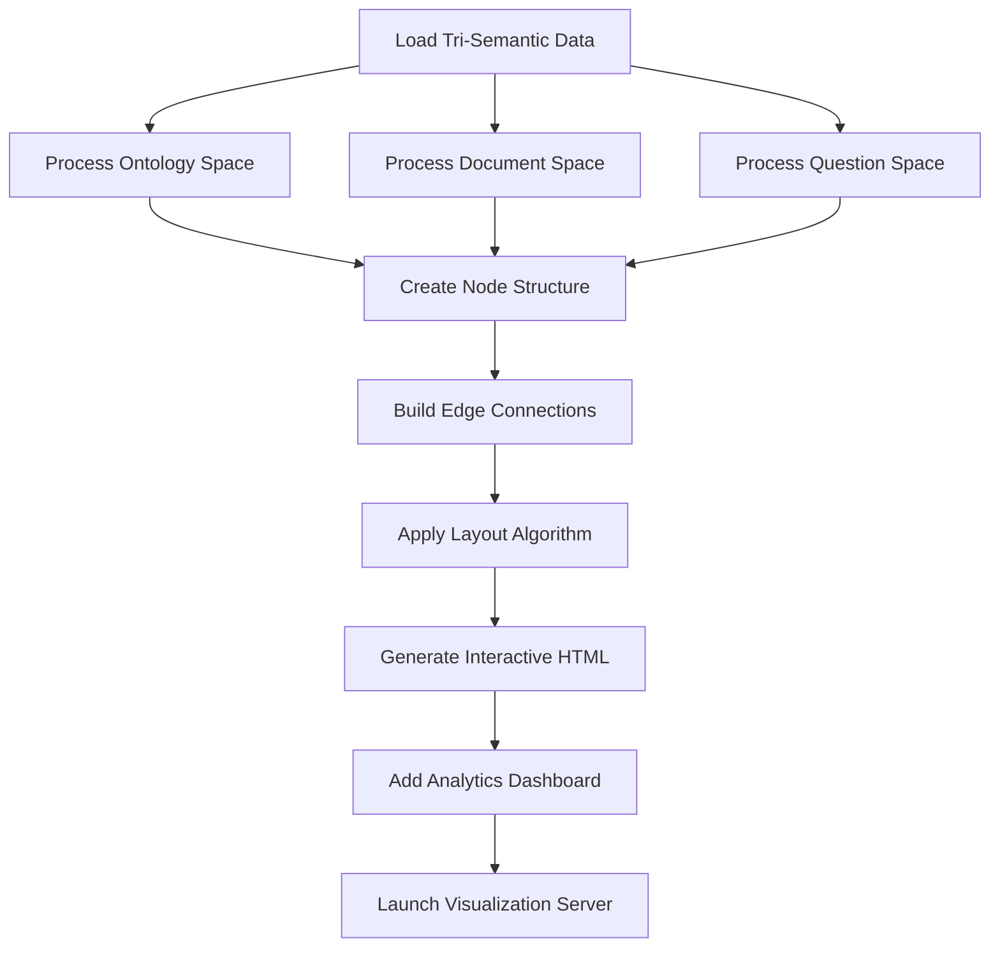

# R5X Tri-Semantic Visualizer Architecture

## Component Overview
**Purpose**: Revolutionary visualization of R4X Cross-Pipeline Semantic Integration  
**Pipeline Stage**: R-Pipeline Visualization - Tri-Semantic Display  
**Script**: `R5X_tri_semantic_visualizer.py`  
**Innovation**: First visualization system displaying dynamic integration of three semantic spaces

## Architecture Design

### Visualization Framework
```python
class R5X_TriSemanticVisualizer:
    def __init__(self):
        self.r4x_integrator = R4X_CrossPipelineSemanticIntegrator()
        self.visualization_types = {
            'tri_semantic_network': 'Interactive network showing three semantic spaces',
            'cross_pipeline_bridges': 'Semantic bridges between pipelines',
            'fusion_process_flow': 'Dynamic fusion process visualization',
            'enhancement_heatmap': 'Quality enhancement analysis',
            'integration_analytics': 'Real-time integration metrics'
        }
        self.semantic_colors = {
            'ontology_space': '#FF6B6B',      # Vibrant Red
            'document_space': '#4ECDC4',      # Teal Green
            'question_space': '#45B7D1',      # Sky Blue
            'fusion_nodes': '#96CEB4',        # Sage Green
            'bridge_connections': '#FECA57'    # Warm Yellow
        }
```

### Input Data Processing
- **Source Data**:
  - R4L lexical ontology output
  - R4X integration results
  - A2.9 enhanced document concepts
  - B5.1 comprehensive question understanding
  - R4X fusion results
- **Data Format**: JSON from multiple pipeline outputs
- **Integration**: Unified tri-semantic dataset

### Core Visualization Components

#### 1. Tri-Semantic Network Visualization
```python
network_components = {
    'nodes': {
        'ontology_nodes': Concepts from R-Pipeline,
        'document_nodes': Concepts from A-Pipeline,
        'question_nodes': Understanding dimensions from B-Pipeline,
        'fusion_nodes': R4X integration points
    },
    'edges': {
        'intra_space_edges': Within semantic space connections,
        'cross_space_bridges': Between space connections,
        'fusion_connections': To/from fusion nodes
    }
}
```

#### 2. Visual Encoding System
- **Node Properties**:
  - Size: Importance/confidence
  - Color: Semantic space membership
  - Shape: Concept type
  - Position: Force-directed or structured layout
- **Edge Properties**:
  - Width: Relationship strength
  - Color: Connection type
  - Style: Solid/dashed for different relationships
  - Arrows: Directionality

#### 3. Interactive Features
- **Node Interactions**: Click for details, hover for preview
- **Edge Interactions**: Hover for relationship info
- **Zoom/Pan**: Navigate large networks
- **Filtering**: Show/hide semantic spaces
- **Search**: Find specific concepts
- **Export**: Save visualizations

### Visualization Generation Pipeline



### Network Generation Algorithms

#### Node Creation and Positioning
```python
def create_tri_semantic_network_data(self, tri_semantic_data):
    nodes = []
    node_id_counter = 0
    
    # Ontology Space Nodes (circular layout)
    for concept_id, concept_data in ontology_concepts.items():
        nodes.append({
            'id': f"ont_{node_id_counter}",
            'label': concept_data.get('theme_name'),
            'group': 'ontology_space',
            'color': self.semantic_colors['ontology_space'],
            'size': self.node_sizes['primary_concept'],
            'x': math.cos(angle) * 300,
            'y': math.sin(angle) * 300
        })
    
    # Document Space Nodes (offset circular)
    # Question Space Nodes (third position)
    # Fusion Nodes (center)
    
    return nodes
```

#### Bridge Edge Creation
```python
def _create_bridge_edges(self, edges, node_map, tri_semantic_data):
    # Cross-space semantic bridges
    for bridge in semantic_bridges:
        edges.append({
            'from': source_node,
            'to': target_node,
            'color': self.semantic_colors['bridge_connections'],
            'width': self.edge_weights['cross_space_bridge'],
            'type': 'cross_space_bridge',
            'dashes': [5, 5]  # Dashed for bridges
        })
    
    # Fusion connections (star pattern from center)
    for fusion_node in fusion_nodes:
        for connected_node in connected_nodes:
            edges.append({
                'from': fusion_node,
                'to': connected_node,
                'color': self.semantic_colors['fusion_nodes'],
                'width': self.edge_weights['fusion_connection']
            })
```

### Visualization Types

#### 1. Tri-Semantic Network
- **Purpose**: Show complete integration network
- **Layout**: Force-directed with semantic space clustering
- **Interactions**: Full node/edge interactions
- **Insights**: Integration patterns, bridge effectiveness

#### 2. Enhancement Heatmap
- **Purpose**: Display enhancement quality across system
- **Layout**: Matrix visualization
- **Dimensions**: Pipelines × Quality Dimensions
- **Color Scale**: Red (poor) to Green (excellent)

#### 3. Fusion Process Flow
- **Purpose**: Show fusion strategy execution
- **Layout**: Sequential flow diagram
- **Stages**: 8 fusion process stages
- **Metrics**: Per-stage confidence and timing

#### 4. Integration Analytics Dashboard
- **Purpose**: Real-time system metrics
- **Components**:
  - Total nodes/edges counters
  - Network density gauge
  - Semantic bridge effectiveness
  - Processing time metrics

### HTML Visualization Template
```html
<!DOCTYPE html>
<html>
<head>
    <title>R5X Tri-Semantic Integration Visualizer</title>
    <script src="vis-network.min.js"></script>
    <script src="plotly.min.js"></script>
    <style>
        .dashboard { 
            display: grid; 
            grid-template-columns: 1fr 1fr;
            gap: 1rem;
        }
        .panel {
            background: rgba(255,255,255,0.95);
            border-radius: 15px;
            box-shadow: 0 8px 32px rgba(0,0,0,0.1);
        }
    </style>
</head>
<body>
    <div id="tri-semantic-network"></div>
    <div id="enhancement-heatmap"></div>
    <div id="analytics-dashboard"></div>
</body>
</html>
```

### Visualization Libraries

#### vis.js Network
- **Purpose**: Interactive network visualization
- **Features**: Force-directed layout, clustering, physics simulation
- **Customization**: Full control over nodes/edges
- **Performance**: Handles 1000+ nodes smoothly

#### Plotly.js
- **Purpose**: Statistical visualizations
- **Features**: Heatmaps, bar charts, time series
- **Interactivity**: Hover, zoom, pan
- **Export**: PNG, SVG, JSON

### Performance Optimization

#### Network Rendering
```python
optimization_config = {
    'physics': {
        'enabled': True,
        'solver': 'forceAtlas2Based',
        'maxVelocity': 146,
        'minVelocity': 0.1,
        'timestep': 0.35
    },
    'interaction': {
        'hover': True,
        'tooltipDelay': 200,
        'hideEdgesOnDrag': True
    }
}
```

#### Data Management
- **Incremental Loading**: Load data progressively
- **Viewport Culling**: Render only visible nodes
- **Level of Detail**: Simplify distant nodes
- **Caching**: Cache computed layouts

### Analytics Integration

#### Network Metrics
```python
network_metrics = {
    'total_nodes': Count all nodes,
    'total_edges': Count all edges,
    'network_density': edges / (nodes * (nodes-1) / 2),
    'average_degree': Average connections per node,
    'clustering_coefficient': Local clustering measure,
    'semantic_bridge_count': Cross-space connections
}
```

#### Quality Metrics
```python
quality_metrics = {
    'enhancement_coverage': % of enhanced components,
    'integration_effectiveness': Average bridge strength,
    'fusion_confidence': Average fusion scores,
    'tri_semantic_coherence': Overall system coherence
}
```

### Server Architecture

#### Local Web Server
```python
def launch_visualization(self, html_file, port=8086):
    class QuietHandler(http.server.SimpleHTTPRequestHandler):
        def log_message(self, format, *args):
            pass  # Suppress logs
    
    with socketserver.TCPServer(("", port), QuietHandler) as httpd:
        server_thread = threading.Thread(target=httpd.serve_forever)
        server_thread.daemon = True
        server_thread.start()
        
        webbrowser.open(f"http://localhost:{port}/R5X_visualization.html")
```

### Output Formats

#### HTML Visualization
- Self-contained HTML file
- Embedded data and scripts
- No external dependencies
- Portable and shareable

#### Data Export
- Network data (JSON)
- Metrics summary (CSV)
- Screenshots (PNG)
- Interactive state (JSON)

### Error Handling
- **Missing Data**: Graceful degradation
- **Large Networks**: Progressive rendering
- **Browser Compatibility**: Fallback visualizations
- **Server Issues**: Direct file opening

### Configuration Options
```python
config = {
    'visualization_types': ['all'],
    'max_nodes_display': 500,
    'enable_physics': True,
    'auto_layout': True,
    'color_scheme': 'default',
    'export_formats': ['html', 'json', 'png'],
    'server_port': 8086,
    'auto_launch_browser': True
}
```

## Revolutionary Features

### Tri-Semantic Integration Display
- First visualization of three semantic spaces
- Dynamic cross-pipeline bridges
- Real-time fusion visualization
- Emergent pattern discovery

### Interactive Exploration
- Multi-level zoom
- Semantic space filtering
- Concept search
- Relationship exploration

### Quality Visualization
- Enhancement effectiveness
- Integration quality
- Confidence display
- Performance metrics

## Benefits

### For Understanding
- Visual comprehension of integration
- Pattern recognition
- Relationship discovery
- Quality assessment

### For Debugging
- Pipeline flow visualization
- Integration point inspection
- Performance bottleneck identification
- Error localization

### For Communication
- Shareable visualizations
- Interactive presentations
- Documentation support
- Stakeholder engagement

## Future Enhancements
- 3D network visualization
- VR/AR support
- Real-time streaming updates
- Collaborative exploration
- AI-guided tours
- Automated insight generation