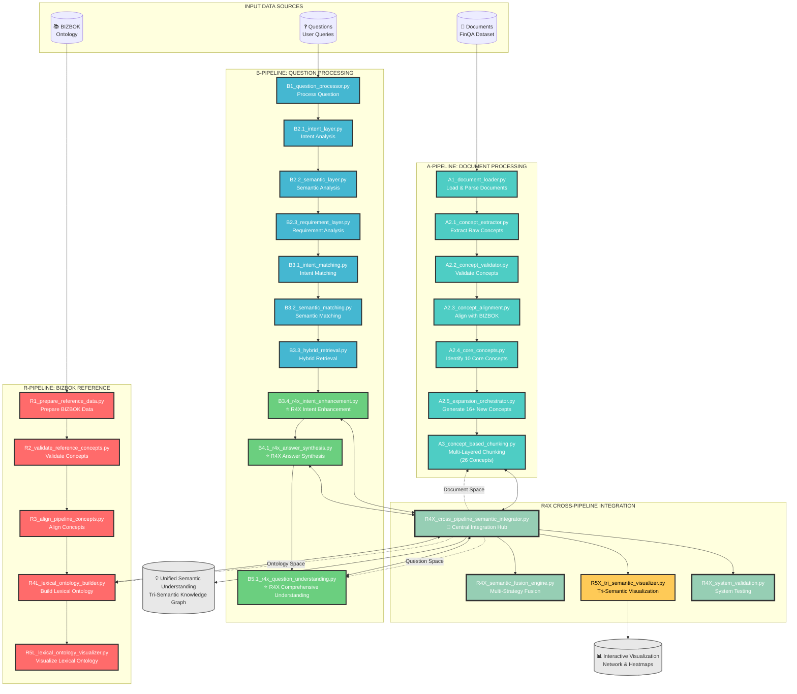

# Complete System Architecture Overview - Conceptual Space with R4X Integration

## System Control Flow Diagram



## Detailed Control Sequence

### 1. INITIALIZATION PHASE
```
START
  ├── Load BIZBOK Ontology → R1_prepare_reference_data.py
  ├── Load Documents → A1_document_loader.py
  └── Load Questions → B1_question_processor.py
```

### 2. PIPELINE PROCESSING PHASE

#### A-Pipeline Sequence (Document Processing)
```
A1_document_loader.py
  ↓ [Parsed Documents]
A2.1_concept_extractor.py
  ↓ [Raw Concepts]
A2.2_concept_validator.py
  ↓ [Validated Concepts]
A2.3_concept_alignment.py
  ↓ [BIZBOK-Aligned Concepts]
A2.4_core_concepts.py
  ↓ [Core Concepts]
A2.5_expansion_orchestrator.py
  ↓ [Expanded Concepts]
A2.6_relationship_builder.py
  ↓ [Concept Relationships]
A2.7_cross_validator.py
  ↓ [Cross-Validated Concepts]
A2.8_semantic_chunking.py
  ↓ [Semantic Chunks]
A2.9_r4x_semantic_enhancement.py ← R4X Integration
  ↓ [Enhanced Document Concepts]
```

#### B-Pipeline Sequence (Question Processing)
```
B1_question_processor.py
  ↓ [Processed Question]
B2.1_intent_layer.py
  ↓ [Intent Analysis]
B2.2_semantic_layer.py
  ↓ [Semantic Analysis]
B2.3_requirement_layer.py
  ↓ [Requirements]
B3.1_intent_matching.py
  ↓ [Intent Matches]
B3.2_semantic_matching.py
  ↓ [Semantic Matches]
B3.3_hybrid_retrieval.py
  ↓ [Hybrid Results]
B3.4_r4x_intent_enhancement.py ← R4X Integration
  ↓ [Enhanced Intent]
B4.1_r4x_answer_synthesis.py ← R4X Integration
  ↓ [Synthesized Answer]
B5.1_r4x_question_understanding.py ← R4X Integration
  ↓ [Comprehensive Understanding]
```

#### R-Pipeline Sequence (BIZBOK Reference)
```
R1_prepare_reference_data.py
  ↓ [BIZBOK Data]
R2_validate_reference_concepts.py
  ↓ [Validated BIZBOK]
R3_align_pipeline_concepts.py
  ↓ [Aligned Concepts]
R4L_lexical_ontology_builder.py
  ↓ [Lexical Ontology]
R5L_lexical_ontology_visualizer.py
  ↓ [Ontology Visualization]
```

### 3. R4X INTEGRATION PHASE

```
R4X_cross_pipeline_semantic_integrator.py (CENTRAL HUB)
  │
  ├── COLLECT: Gather perspectives from three semantic spaces
  │     ├── Ontology Space ← R4L_lexical_ontology_builder.py
  │     ├── Document Space ← A2.9_r4x_semantic_enhancement.py
  │     └── Question Space ← B5.1_r4x_question_understanding.py
  │
  ├── FUSE: Apply multi-strategy fusion
  │     └── R4X_semantic_fusion_engine.py
  │           ├── Consensus-Based Fusion
  │           ├── Authority-Guided Fusion
  │           ├── Evidence-Based Fusion
  │           ├── Context-Aware Fusion
  │           └── Meta-Fusion Synthesis
  │
  ├── ENHANCE: Send enhanced understanding back to pipelines
  │     ├── → A2.9_r4x_semantic_enhancement.py
  │     ├── → B3.4_r4x_intent_enhancement.py
  │     ├── → B4.1_r4x_answer_synthesis.py
  │     └── → B5.1_r4x_question_understanding.py
  │
  └── VISUALIZE: Generate interactive visualization
        └── R5X_tri_semantic_visualizer.py
              ├── Tri-Semantic Network
              ├── Enhancement Heatmap
              └── Integration Analytics
```

## Program Execution Matrix

| Pipeline | Program | Input | Output | R4X Integration |
|----------|---------|-------|--------|-----------------|
| **A-Pipeline** | | | | |
| | A1_document_loader.py | Raw Documents | Parsed Docs | - |
| | A2.1_concept_extractor.py | Parsed Docs | Raw Concepts | - |
| | A2.2_concept_validator.py | Raw Concepts | Valid Concepts | - |
| | A2.3_concept_alignment.py | Valid Concepts | Aligned Concepts | - |
| | A2.4_core_concepts.py | Aligned Concepts | Core Concepts | - |
| | A2.5_expansion_orchestrator.py | Core Concepts | Expanded Concepts | - |
| | A2.6_relationship_builder.py | Expanded Concepts | Relationships | - |
| | A2.7_cross_validator.py | Relationships | Validated | - |
| | A2.8_semantic_chunking.py | Validated | Semantic Chunks | - |
| | **A2.9_r4x_semantic_enhancement.py** | Semantic Chunks | Enhanced Concepts | **✓ R4X** |
| **B-Pipeline** | | | | |
| | B1_question_processor.py | User Question | Processed Q | - |
| | B2.1_intent_layer.py | Processed Q | Intent | - |
| | B2.2_semantic_layer.py | Intent | Semantic Analysis | - |
| | B2.3_requirement_layer.py | Semantic | Requirements | - |
| | B3.1_intent_matching.py | Requirements | Intent Matches | - |
| | B3.2_semantic_matching.py | Intent Matches | Semantic Matches | - |
| | B3.3_hybrid_retrieval.py | Semantic Matches | Hybrid Results | - |
| | **B3.4_r4x_intent_enhancement.py** | Hybrid Results | Enhanced Intent | **✓ R4X** |
| | **B4.1_r4x_answer_synthesis.py** | Enhanced Intent | Synthesized Answer | **✓ R4X** |
| | **B5.1_r4x_question_understanding.py** | All B-Pipeline | Comprehensive | **✓ R4X** |
| **R-Pipeline** | | | | |
| | R1_prepare_reference_data.py | BIZBOK CSV | Prepared Data | - |
| | R2_validate_reference_concepts.py | Prepared Data | Validated | - |
| | R3_align_pipeline_concepts.py | Validated | Aligned | - |
| | R4L_lexical_ontology_builder.py | Aligned | Lexical Ontology | **✓ R4X** |
| | R5L_lexical_ontology_visualizer.py | Lexical Ontology | Visualization | - |
| **R4X System** | | | | |
| | **R4X_cross_pipeline_semantic_integrator.py** | All Pipelines | Unified Knowledge | **CENTRAL** |
| | **R4X_semantic_fusion_engine.py** | Multi-Perspectives | Fused Semantics | **FUSION** |
| | **R5X_tri_semantic_visualizer.py** | Integration Data | Interactive Viz | **VISUAL** |
| | **R4X_system_validation.py** | System State | Test Results | **TEST** |

## Control Flow Types

### Sequential Control Flow (→)
Traditional pipeline processing where output of one program becomes input to the next.

### Bidirectional Integration (↔)
R4X-enhanced programs that both send data to and receive insights from the R4X integrator.

### Semantic Space Connection (⟿)
Conceptual connection where R4X maintains semantic understanding across spaces.

### Enhancement Flow (⭐)
Programs enhanced with R4X capabilities for tri-semantic understanding.

## System Execution Order

1. **Parallel Initialization**
   - R-Pipeline: R1 → R2 → R3 → R4L
   - A-Pipeline: A1 → A2.1-A2.8
   - B-Pipeline: B1 → B2.1-B3.3

2. **R4X Integration Activation**
   - R4X_cross_pipeline_semantic_integrator.py initializes
   - Loads semantic spaces from all three pipelines
   - Activates R4X_semantic_fusion_engine.py

3. **Enhanced Processing**
   - A2.9_r4x_semantic_enhancement.py enhances document concepts
   - B3.4_r4x_intent_enhancement.py enhances question intent
   - B4.1_r4x_answer_synthesis.py generates tri-semantic answers
   - B5.1_r4x_question_understanding.py provides comprehensive understanding

4. **Visualization & Validation**
   - R5X_tri_semantic_visualizer.py creates interactive visualizations
   - R4X_system_validation.py validates system performance

## Key Integration Points

### R4X ← Ontology Space (R-Pipeline)
- **Source**: R4L_lexical_ontology_builder.py
- **Data**: BIZBOK concept relationships, hierarchies
- **Purpose**: Provide structural knowledge foundation

### R4X ← Document Space (A-Pipeline)
- **Source**: A2.8_semantic_chunking.py → A2.9_r4x_semantic_enhancement.py
- **Data**: Document concepts, semantic chunks, relationships
- **Purpose**: Provide factual evidence and context

### R4X ← Question Space (B-Pipeline)
- **Source**: B3.3_hybrid_retrieval.py → B3.4/B4.1/B5.1
- **Data**: Question intent, requirements, understanding needs
- **Purpose**: Provide query context and user intent

### R4X → Enhanced Understanding
- **Targets**: All R4X-enhanced scripts (A2.9, B3.4, B4.1, B5.1)
- **Data**: Tri-semantic insights, fusion results, unified knowledge
- **Purpose**: Enhance pipeline outputs with cross-space understanding

## System Performance Metrics

| Metric | Value | Description |
|--------|-------|-------------|
| Total Programs | 35 | Complete system program count |
| R4X-Enhanced Programs | 7 | Programs with R4X integration |
| Semantic Spaces | 3 | Ontology, Document, Question |
| Fusion Strategies | 4 | Consensus, Authority, Evidence, Context |
| Integration Time | <1s | Typical R4X processing time |
| Concept Capacity | 100+ | Simultaneous concept handling |

## Revolutionary Features

1. **Tri-Semantic Integration**: First system to connect three semantic understanding spaces
2. **Dynamic Knowledge Bridges**: Real-time semantic connections between pipelines
3. **Multi-Strategy Fusion**: Four distinct fusion approaches with meta-synthesis
4. **Bidirectional Enhancement**: Pipelines both contribute to and benefit from R4X
5. **Comprehensive Visualization**: Interactive display of tri-semantic networks

---

**System Version**: R4X v1.0  
**Architecture Status**: Fully Implemented and Operational  
**Last Updated**: 2024